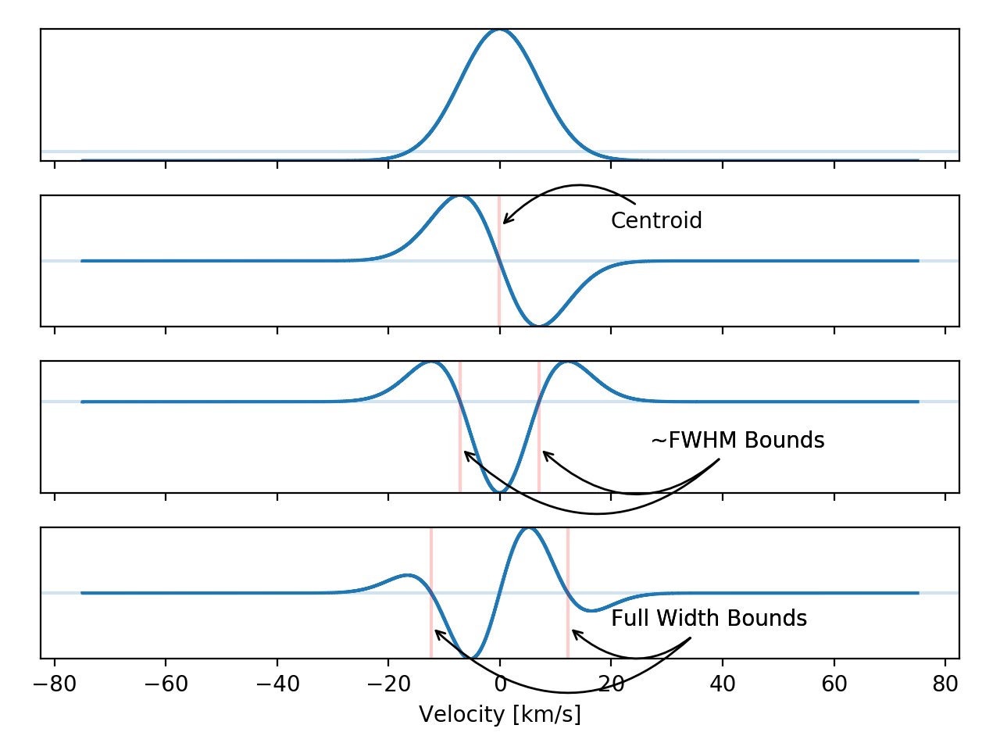

.. _line-finding:

Line Finding
============

Spectacle has automated line-finding and characterization, including support
for blended features. The line finder uses a series of convolutions to indicate
where the slope of the spectrum changes, and uses these positions to
characterize the shape of the absorption or emission lines. Such
characterization includes finding the centroid, the width of the line, and the
whether or not lines are buried within the region of another.

The line finder will return a generated spectral model from the found lines.

Auto-generate spectral model
----------------------------

The inputs to the :class:`~spectacle.fitting.line_finding.LineFinder` class
help dictate the behavior of the finding routine and what lines the finder will
consider when it believes it has found a feature.

The user may note that the line finder takes many of the same parameters accepted when
creating a :class:`~specviz.modeling.models.Spectral1D` model explicitly. This
is because these parameter are based onto the internal initialization of the
spectral model. The accepted line finder arguments are summarized in the table
below.

+---------------------+------------------------------------------------------------------------------------------------------------------------------------------------+
| Argument            | Description                                                                                                                                    |
+=====================+================================================================================================================================================+
| ions                | The subset of ion information to use when parsing potential profiles in the spectral data.                                                     |
+---------------------+------------------------------------------------------------------------------------------------------------------------------------------------+
| continuum           | A :class:`~astropy.modeling.models.FittableModel1D` or single numeric value,representing the continuum for the spectral model. *Default: 0*    |
+---------------------+------------------------------------------------------------------------------------------------------------------------------------------------+
| defaults            | A dictionary describing the default arguments passed to internal :class:`~specviz.modeling.profiles.OpticalDepth1D` profiles.                  |
+---------------------+------------------------------------------------------------------------------------------------------------------------------------------------+
| auto_fit            | Whether the line finder should attempt to automatically fit the resulting spectral model to the provided data.                                 |
+---------------------+------------------------------------------------------------------------------------------------------------------------------------------------+
| velocity_convention | The velocity convention used in internal conversions between wavelength/frequency and velocity space.                                          |
+---------------------+------------------------------------------------------------------------------------------------------------------------------------------------+
| output              | Describes the type of data the spectrum model will produce. This can be one of `flux`, `flux_decrement`, or `optical_depth`. *Default: `flux`* |
+---------------------+------------------------------------------------------------------------------------------------------------------------------------------------+

The ``ions`` argument allows the user to select a subset of the entire ion
table for the line finder to use when attempting to parse a particular profile.
If no ions are provided, the entire ion table will be searched to find the
ion whose :math:`\lambda_0` most closely aligns with the detected centroid.

.. note::

    Currently, when running the line finder in velocity space, only one ion
    definition is supported at a time. This is because there is no way to
    disambiguate the kinematics of multiple ions simultaneously in velocity
    space.

As an example of the line finder functionality, let us define two lines within
a set of "fake" data.

.. code-block:: python

    line1 = OpticalDepth1D("HI1216", v_doppler=20 * u.km/u.s, column_density=16)
    line2 = OpticalDepth1D("OVI1032", v_doppler=60 * u.km/u.s, column_density=14)

    spec_mod = Spectral1D([line1, line2], continuum=1, output='optical_depth')

We will describe the lines in wavelength space to disambiguate their
emission profiles without considering kinematics.

.. code-block:: python

    x = np.linspace(1000, 1300, 1000) * u.Unit('Angstrom')
    y = spec_mod(x)

Now we tell the line finder that there are two possible lines that
any feature it comes across could be. Doing so means that any
:class:`~spectacle.modeling.profiles.OpticalDepth1D` profiles generated
will be given the correct attributes (e.g. ``f_value``, ``gamma``, etc.) when
the line finder attempts to lookup the ion in the ion table.

.. code-block:: python

    line_finder = LineFinder1D(ions=["HI1216", "OVI1032"], continuum=0, output='optical_depth')
    finder_spec_mod = line_finder(x, y)

.. plot::
    :align: center
    :context: close-figs

    >>> from astropy import units as u
    >>> import numpy as np
    >>> from matplotlib import pyplot as plt
    >>> from spectacle.modeling import Spectral1D, OpticalDepth1D
    >>> from spectacle.fitting.line_finder import LineFinder1D
    >>> line1 = OpticalDepth1D("HI1216", v_doppler=20 * u.km/u.s, column_density=16)
    >>> line2 = OpticalDepth1D("OVI1032", v_doppler=60 * u.km/u.s, column_density=16)
    >>> spec_mod = Spectral1D([line1, line2], continuum=0, output='optical_depth')
    >>> x = np.linspace(1000, 1300, 10000) * u.Unit('Angstrom')
    >>> y = spec_mod(x)

    >>> line_finder = LineFinder1D(ions=["HI1216", "OVI1032"], continuum=0, output='optical_depth')
    >>> finder_spec_mod = line_finder(x, y)
    >>> finder_y = finder_spec_mod(x)
    >>> mask1 = (x.value >= line1.lambda_0.value - 2) & (x.value <= line1.lambda_0.value + 2)
    >>> mask2 = (x.value >= line2.lambda_0.value - 2) & (x.value <= line2.lambda_0.value + 2)
    >>> f, (ax1, ax2) = plt.subplots(1, 2, sharey=True)   # doctest: +SKIP
    >>> ax1.step(x[mask2], y[mask2], label="Original Data")  # doctest: +SKIP
    >>> ax1.step(x[mask2], finder_y[mask2], label="Finder Result")  # doctest: +SKIP
    >>> ax2.step(x[mask1], y[mask1])  # doctest: +SKIP
    >>> ax2.step(x[mask1], finder_y[mask1])  # doctest: +SKIP
    >>> ax1.set_title("OVI1032")  # doctest: +SKIP
    >>> ax2.set_title("HI1216")  # doctest: +SKIP
    >>> f.add_subplot(111, frameon=False)  # doctest: +SKIP
    >>> plt.xlabel("Wavelength [Angstrom]")  # doctest: +SKIP
    >>> plt.tick_params(labelcolor='none', top=False, bottom=False, left=False, right=False)  # doctest: +SKIP
    >>> f.legend()  # doctest: +SKIP
    >>> f.subplots_adjust(wspace=0)  # doctest: +SKIP

Dealing with buried lines
^^^^^^^^^^^^^^^^^^^^^^^^^

The line finder will implicitly deal with buried lines by considering the
results of the series of convolutions and looking for characteristics that
might indicate that the peak of a line is buried within the region of another
profile.

The basic premise for determining the possibility of a buried line is to
compare the bounds of the second differencing convolution with that of the
third. A buried line is one which, in both cases, share the same found
centroid, but two different sets of region bounds.

.. plot::
    :align: center
    :context: close-figs

    >>> from astropy import units as u
    >>> import numpy as np
    >>> from matplotlib import pyplot as plt
    >>> from spectacle.modeling import Spectral1D, OpticalDepth1D
    >>> from spectacle.fitting.line_finder import LineFinder1D
    >>> line1 = OpticalDepth1D("HI1216", v_doppler=10 * u.km/u.s, column_density=14)
    >>> line2 = OpticalDepth1D("HI1216", v_doppler=70 * u.km/u.s, column_density=15)
    >>> spec_mod = Spectral1D([line1, line2], continuum=0, output='optical_depth')
    >>> x = np.linspace(-200, 200, 1000) * u.Unit('km/s')
    >>> y = spec_mod(x)

    >>> line_finder = LineFinder1D(ions=["HI1216"], continuum=0, output='optical_depth')
    >>> finder_spec_mod = line_finder(x, y)
    >>> f, ax = plt.subplots()  # doctest: +SKIP
    >>> ax.step(x, y, label="Original Data") # doctest: +SKIP
    >>> ax.step(x, finder_spec_mod(x), label="Finder Result") # doctest: +SKIP
    >>> ax.set_xlabel("Velocity [km/s]")  # doctest: +SKIP
    >>> f.legend()  # doctest: +SKIP

Defining default parameters
---------------------------

The line finder class can accept a ``defaults`` dictionary whose values will
be applied when new :class:`~spectacle.models.profiles.OpticalDepth1D` profiles
are initialized. This is an easy way, for example, to manually set global
parameter bounds information that would otherwise be up to Spectacle to determine.

.. code-block:: python

    defaults_dict = {
        'v_doppler': {
            'bounds': (-10, 10),
            'fixed': False
        },
        'column_density' = {
            'bounds': (13, 18)
        }
    }

    line_finder = LineFinder1D(ions=["HI1216"], defaults=defaults_dict, continuum=0, output='optical_depth')

Searching for ion subsets
-------------------------

As mentioned above, the line finder attempts to retrieve information about a
potential profile by looking up the detected centroid in the ion table and
selecting the nearest match. (A more extensive overview of the line registry can be
found in the :ref:`line registry docs <registries>`). The user
can provide a subset of ions that will help to narrow the possible options
available to the line finder by passing in a list of ion names or
:math:`\lambda_0` values. The default ion list is provided by Morton (2003).

Subsets behave by limiting the entire table of ions in the registry to some
specified list:

.. code-block:: python
    :linenos:

    >>> from spectacle.registries.lines import line_registry
    >>> print(line_registry)  # doctest: +IGNORE_OUTPUT

    <LineRegistry length=329>
      name      wave    osc_str     gamma
              Angstrom
      str9    float64   float64    float64
    -------- --------- --------- ------------
      HI1216 1215.6701    0.4164  626500000.0
      HI1026 1025.7223   0.07912  189700000.0
       HI973  972.5368     0.029   81270000.0
       HI950  949.7431   0.01394   42040000.0
       HI938  937.8035  0.007799   24500000.0
       HI931  930.7483  0.004814   12360000.0
       HI926  926.2257  0.003183    8255000.0
         ...       ...       ...          ...
    NiII1317  1317.217   0.07786  420500000.0
    CuII1368 1367.9509     0.179  623000000.0
    CuII1359  1358.773    0.3803  720000000.0
    ZnII2063  2062.664     0.256  386000000.0
    ZnII2026  2026.136     0.489  407000000.0
    GeII1602 1602.4863    0.1436  990600000.0
    GaII1414  1414.402       1.8 1970000000.0

    >>> subset = line_registry.subset(["HI1216", "NiII1468", "ZnII2026", "CoII1425"])
    >>> print(subset)  # doctest: +IGNORE_OUTPUT

    <LineRegistry length=4>
      name      wave   osc_str    gamma
              Angstrom
      str9    float64  float64   float64
    -------- --------- ------- -----------
    CoII1425 1424.7866  0.0109  35800000.0
      HI1216 1215.6701  0.4164 626500000.0
    NiII1468  1467.756  0.0099  23000000.0
    ZnII2026  2026.136   0.489 407000000.0

Passing in a list to the :class:`spectacle.fitting.line_finder.LineFinder1D`
will internally do this for the user

.. code-block:: python

    line_finder = LineFinder1D(ions=["HI1216", "NiII1468", "ZnII2026", "CoII1425"], continuum=0, output='optical_depth')

.. warning::

    Only a single ion can be defined for the line finder if the user provides
    the dispersion in velocity space. This is because the line finder cannot
    disambiguate ions based on their kinematics.